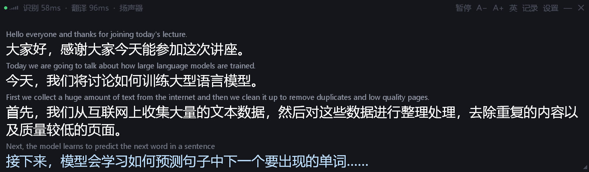

<p align="center"></p>

# Live Interpreter (同声传译)

An offline, low-latency English-to-Chinese simultaneous interpreter for Windows and macOS (Apple silicon). It listens to whatever the PC is playing (lectures, meetings, videos) or to a microphone, transcribes the speech with a cache-aware streaming recognizer, translates it with an on-device translation model, and shows bilingual live captions in an always-on-top overlay. Audio and text never leave the machine.

[中文说明](README.zh-CN.md) · [Download](https://github.com/haoawake/live-interpreter/releases/latest)

**Stack:** Python 3.12 · sherpa-onnx (ONNX Runtime) · NVIDIA Nemotron Speech Streaming 0.6B · llama.cpp (CUDA / Vulkan / Metal) · Tencent HY-MT1.5-1.8B · WASAPI · Core Audio (Swift) · Tkinter · PyInstaller



---

## Motivation

Cloud captioning adds a network round trip to every sentence, needs an account, and sends the audio of a lecture or a meeting to a third party. Live Interpreter runs the whole chain on a consumer laptop and is tuned for one job: showing a usable Chinese rendering of what is being said while it is still being said.

## Highlights

| | |
|---|---|
| **True streaming recognition** | A cache-aware FastConformer-RNNT model decodes 160 ms chunks incrementally and reuses encoder state instead of re-transcribing a sliding window. Words appear as they are spoken, with punctuation and casing. |
| **Translation that keeps up** | The unfinished sentence is re-translated after every new word and shown as a tentative line; when the sentence ends it is translated once more and committed. A committed sentence takes 60–240 ms on a laptop GPU. |
| **Fully offline** | Recognition runs on the CPU, translation on the local GPU (CUDA or Vulkan on Windows, Metal on a Mac) or the CPU. No API keys and no network traffic after the first-run download. |
| **Any audio source** | Anything the computer plays is captured (WASAPI loopback on Windows; a Core Audio process tap on macOS 14.2+, no virtual audio driver needed); microphones work as well. The default source follows Windows' default device when headphones are plugged in or removed. |
| **Glossary** | `English = 中文` pairs are injected through the model's terminology prompt, so course- or company-specific terms are translated consistently. Edits take effect without a restart. |
| **Nothing to install** | A single-folder executable of about 90 MB on Windows; on a Mac, `同声传译.app` dragged into Applications. The first launch downloads the models (about 2 GB) from their publishers, with resume and a mirror option. |

## Architecture

```
System audio (WASAPI loopback) / microphone
  │  10 ms blocks at the device rate, resampled inside sherpa-onnx
  ▼
Streaming ASR ── Nemotron Speech Streaming en 0.6B, int8, sherpa-onnx on the CPU
  │  append-only transcript, extended once per 160 ms chunk
  ▼
Segmenter ── commits a sentence when the next one starts, shortly after a full stop,
  │          or after a pause; over-long clauses are cut at a comma
  ├─ unfinished text ──► live lane  ──┐
  └─ committed sentence ► final lane ─┴─► llama-server, 2 slots ── HY-MT1.5-1.8B Q4_K_M
                                          │
                                          ▼
                 Overlay: committed sentences (white) + sentence in progress (blue)
```

Capture, recognition and both translation lanes run on worker threads and report through one event queue; the Tk main loop only renders.

### Design notes

- **The recognizer is never reset while someone is speaking.** Streaming transducers emit tokens with a delay. Resetting the stream at a one-second pause, which is what endpoint detection normally does, consumed the frames of the next word before that word was emitted. In a test lecture the words "Today" and "First" disappeared and every sentence-final period was lost. The stream now runs continuously, the segmenter tracks committed words itself, and the stream is reset only after three seconds of silence with nothing pending.
- **Segmentation.** This model emits a sentence's full stop about a second after its last word, usually together with the first word of the next sentence. A sentence is therefore committed when the next one begins; 0.2 s plus one chunk after a full stop when nothing follows (the wait also keeps "3." in "3.5" from ending a sentence); or after 0.75 s plus one chunk with no new text. Clauses longer than 24 words are cut at their last comma, and text beyond 40 words is cut regardless, which bounds the latency of run-on speech.
- **No invented endings.** Given a fragment such as "I'm not sure that", the translation model completes the thought ("我不太确定这一点。"). Appending "..." to unfinished text makes it translate only what was said ("我不太确定……"). The ellipsis is stripped again when the sentence is committed.
- **Stable re-translation.** Live requests use greedy decoding, so consecutive translations of a growing sentence share their prefix. The live lane abandons a request only when its sentence is committed, and the overlay swaps in complete translations instead of streaming each one token by token, which would restart the line on every word.
- **Terminology instead of context.** HY-MT's contextual-translation template was tried and rejected: the model translated the context sentence into the output as well. Sentences are translated independently, and the terminology template is used whenever a glossary entry matches, including plural and hyphen/space variants. With the default glossary, "transformer" comes out as "Transformer" rather than "变压器" (electrical transformer).
- **Silent loopback.** WASAPI loopback delivers no packets while nothing is playing. The engine injects silence so the recognizer can flush the words it is holding back, then stops decoding after three seconds of digital silence, so an idle session costs no CPU.
- **Windows specifics.** sherpa-onnx opens model files through the ANSI code page, so models are loaded by relative path after changing into the application folder, which may contain non-ASCII characters. llama-server is assigned to a Job Object and exits with the app, even on a crash. The overlay is a frameless window with its own hit-testing for resizing, and it reads the window rectangle from Win32 because Tk's reported geometry lags behind a resize.

## Performance

Measured on an AMD Ryzen 9 8940HX with an NVIDIA GeForce RTX 5060 Laptop GPU (8 GB) under Windows 11. During the translation measurements another application kept the GPU at about 90 % utilisation.

| Metric | Result |
|---|---|
| Recognition, decode time per 160 ms chunk (CPU) | 52 ms at 8 threads · 61 ms at 4 threads · 102 ms at 2 threads |
| Recognition, real-time factor | 0.36 (160 ms chunks, 8 threads) · 0.13 (560 ms chunks, 4 threads) |
| Translation, time to first token (Q4_K_M) | 35–85 ms |
| Translation, committed sentence end to end | 60–240 ms |
| Model load | 2–3 s |
| Memory | recognizer 0.8 GB RAM · translation 1.5 GB RAM and 1.5 GB VRAM |

Recognition accuracy from the model card, as average WER over eight Open ASR Leaderboard test sets: 7.67 % with 160 ms chunks, 7.07 % with 560 ms chunks, 6.93 % with 1120 ms chunks.

## Requirements

**Windows**

- Windows 10 or 11, 64-bit
- 8 GB of RAM; 16 GB recommended
- A GPU is recommended. NVIDIA cards with driver R580 or newer use the CUDA build of llama.cpp, and AMD and Intel GPUs use the Vulkan build. Without a usable GPU, translation falls back to the CPU at roughly 0.5–1 s per sentence.
- About 2.5 GB of disk space, and an internet connection for the first launch

**macOS**

- A Mac with Apple silicon (M1 or later); Intel Macs are not supported
- macOS 14 Sonoma or later. Capturing system audio needs macOS 14.2 or later; on 14.0 and 14.1 only microphones work
- 8 GB of RAM; 16 GB recommended. Translation runs on the GPU through Metal
- About 2.5 GB of disk space, and an internet connection for the first launch

## Installation

### Windows

1. Download `live-interpreter-v<version>-windows-x64.zip` from [Releases](https://github.com/haoawake/live-interpreter/releases/latest) and extract it anywhere; paths with non-ASCII characters are fine.
2. Run `同声传译.exe`. The first launch lists the components it needs, downloads them with resume support, and can create desktop and Start-menu shortcuts.
3. The executable is not code-signed. If Windows SmartScreen reports "Windows protected your PC", choose **More info → Run anyway**.

### macOS

1. Download `live-interpreter-v<version>-macos-arm64.zip` from [Releases](https://github.com/haoawake/live-interpreter/releases/latest), double-click it, and drag `同声传译.app` into **Applications**.
2. The app is ad-hoc signed but not notarized, so the first launch is blocked. Double-click it once, then open **System Settings → Privacy & Security** and click **Open Anyway** near the bottom; after confirming once it opens normally. (Alternatively run `xattr -cr /Applications/同声传译.app` in Terminal.)
3. The first launch lists the components to download (about 2 GB); click 开始下载. Downloads resume after an interruption.
4. When capture starts, macOS asks whether 同声传译 may record system audio (or use the microphone, if one is selected as the source). Allow it.

### From source

```bat
git clone https://github.com/haoawake/live-interpreter.git
cd live-interpreter
build.bat
```

`build.bat` creates a Python 3.12 virtual environment, installs the dependencies, downloads the models and produces `同声传译.exe`. To run without packaging, use `.venv\Scripts\pythonw.exe app.py`.

On a Mac (python.org Python 3.12 and the Xcode command line tools):

```sh
python3.12 -m venv .venv
.venv/bin/pip install -r requirements.txt pyinstaller
.venv/bin/python build.py --helper     # compile only the Core Audio helper, needed to run from source
.venv/bin/python app.py                # run from source
.venv/bin/python build.py              # dist/同声传译.app and the release zip
```

## Usage

| Action | Effect |
|---|---|
| Drag an edge or a corner | Resize the window; a taller window shows more history |
| Drag anywhere else | Move the window |
| `A−` / `A+`, or Ctrl + mouse wheel (⌘ + scroll on a Mac) | Change the font size |
| `英` | Show or hide the English source |
| `暂停` | Pause recognition |
| `记录` | Open the session's bilingual transcript (copyable) |
| Right-click (on a Mac also a two-finger tap or Control-click), or `设置` | Audio source, recognition mode, translation model and GPU use, display options, transcript saving, glossary; on a Mac the same options are in the 设置 menu of the menu bar |
| `—` | Minimize to the taskbar on Windows; hide the app on a Mac (click its Dock icon to bring it back) |

White lines are committed translations. The blue line is the sentence in progress and may change until the sentence ends. Transcripts are saved to `transcripts\` (this can be turned off), and settings persist in `config.json`. On a Mac these files, the models, the logs and the glossary live in `~/Library/Application Support/同声传译/`; the menu item 在访达中打开记录文件夹 opens the transcripts in Finder.

**Recognition modes.** *Fast* uses 160 ms chunks. *Accurate* uses 560 ms chunks, which lowers the error rate at the cost of about 0.4 s of extra delay. The Q6_K translation model is available as a slightly more accurate alternative to the default Q4_K_M.

**Glossary.** `glossary.txt` holds one entry per line:

```
transformer = Transformer
self-attention = 自注意力
```

## macOS notes

- **System audio** is captured with a Core Audio process tap (macOS 14.2+): a global mono tap that excludes the app itself, attached to a private aggregate device clocked by the default output device. A small Swift helper (`macos/lt-audio.swift`, in `Contents/MacOS`) streams the samples to the app, and rebuilds the tap whenever the default output device changes, the device disappears, or its sample rate changes.
- **Permissions.** The tap needs the *Screen & System Audio Recording* permission (*System Audio Recording Only* is enough) and a microphone needs *Microphone*. Without them macOS delivers silence rather than an error; the helper checks the permission state and notices when other apps are playing but nothing arrives, and the overlay then explains what to do with a button that opens the right pane of System Settings. Because the app is not signed with a developer ID, macOS may ask again after an update.
- **llama.cpp** is the official macOS arm64 build of the same pinned release as on Windows; "使用 GPU 加速（Metal）" offloads every layer to the GPU, otherwise it runs on the performance cores. A watchdog in the helper waits on the app's process with kqueue and kills llama-server the moment the app exits, crash or Force Quit included.
- **Overlay.** The borderless window floats above other windows on every Space and is kept out of ⌘` cycling. macOS does not let it into another app's native full-screen Space, so play videos in a maximised window rather than full screen to keep the captions in view. App Nap is disabled while the app runs so captions do not lag behind a video playing in another app.

## FAQ (macOS)

- **"同声传译" cannot be opened / the developer cannot be verified.** See step 2 of the macOS installation: System Settings → Privacy & Security → Open Anyway.
- **The overlay says it may not record system audio.** Click 打开系统设置 in the banner, enable 同声传译 under Privacy & Security → Screen & System Audio Recording, then quit and reopen the app. For a microphone it is Privacy & Security → Microphone.
- **Permission asked again after updating.** Unsigned apps are identified by their contents, so a new version may need the permission once more. If the switch is already on, turn it off and on again.
- **Intel Mac.** Only Apple silicon is supported.

## Project layout

| Path | Purpose |
|---|---|
| `app.py` | Overlay window, settings menu, transcript window, first-run downloader |
| `engine.py` | Pipeline threads (capture → recognition → segmentation → translation) and a headless test harness |
| `asr.py` | sherpa-onnx streaming recognizer and the sentence segmenter |
| `mt.py` | llama-server process management, prompts, glossary matching, streaming client |
| `audio.py` | Capture entry point; `audio_win.py` is the WASAPI capture that follows the default device, `audio_mac.py` drives the Core Audio helper |
| `macos/lt-audio.swift` | macOS Core Audio helper: process tap for system audio, microphone capture, llama-server watchdog |
| `sys_win.py`, `sys_mac.py` | Platform code: Win32 window tweaks and the Job Object; Cocoa window level, menus, single instance |
| `config.py` | Model registry, paths, default settings |
| `setup_models.py` | Resumable component downloads with mirror fallback, and shortcut creation |
| `build.py`, `build.bat` | PyInstaller packaging (the Windows executable and the macOS .app) |
| `tests/` | Unit tests: `python -m unittest discover -s tests` |
| `.github/workflows/release.yml` | Builds both release packages on GitHub Actions and publishes them when a `v*` tag is pushed |

## Development

Run the pipeline headless on a 16-bit WAV file at real-time speed and print a timeline of every committed sentence and translation:

```bat
.venv\Scripts\python.exe engine.py --wav lecture.wav
.venv\Scripts\python.exe engine.py --wav lecture.wav --all-events
```

`--all-events` also prints the live updates. The packaged app takes the same arguments (on a Mac `同声传译.app/Contents/MacOS/LiveInterpreter --wav lecture.wav`); `--cpu` keeps translation on the CPU. After changing the code, close the app and run `build.bat` to rebuild the executable.

## Known limitations

- English to Chinese only; the recognizer is an English model.
- The live line is re-translated as the sentence grows, so its wording can change until the sentence is committed.
- The mirror option covers the HuggingFace download only; the llama.cpp and recognizer archives are fetched from GitHub Releases.
- Translation slows down while another application saturates the GPU. Translation can be moved to the CPU from the menu.
- The Mac version supports Apple silicon only, and system audio capture needs macOS 14.2 or later. The app is not notarized, so the first launch has to be confirmed under Privacy & Security.

## License

The source code is released under the [MIT License](LICENSE). The release package bundles third-party components under their own licenses, listed in [THIRD_PARTY_NOTICES.md](THIRD_PARTY_NOTICES.md).

The models are not distributed with this repository or its releases. They are downloaded from their publishers on first launch and are governed by the NVIDIA Open Model License (Nemotron Speech Streaming) and the Tencent HY Community License Agreement (HY-MT1.5). The latter does not apply in the European Union, the United Kingdom or South Korea.

## Acknowledgements

[NVIDIA Nemotron Speech Streaming](https://huggingface.co/nvidia/nemotron-speech-streaming-en-0.6b) · [k2-fsa/sherpa-onnx](https://github.com/k2-fsa/sherpa-onnx) · [ggml-org/llama.cpp](https://github.com/ggml-org/llama.cpp) · [Tencent HY-MT](https://github.com/Tencent-Hunyuan/HY-MT) · [PyAudioWPatch](https://github.com/s0d3s/PyAudioWPatch) · [SoundCard](https://github.com/bastibe/SoundCard)
